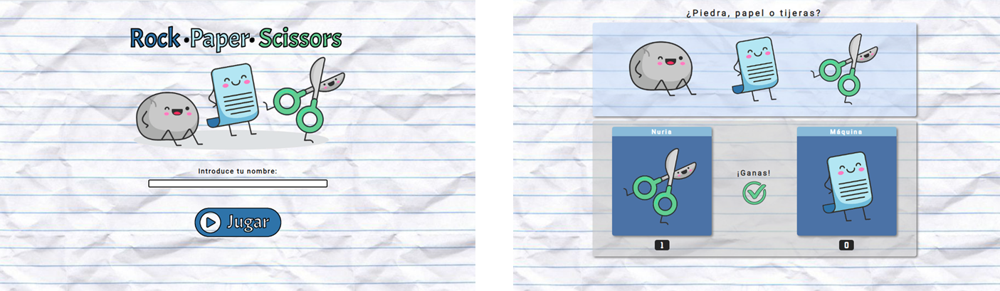

  

Introducción
-------------
Primer proyecto en grupo para desarrollar el tradicional juego de Piedra, Papel o Tijeras usando la lógica de JavaScript junto con HTML5 y CSS3. 

  

Descripción
-------------
* Un único jugador contra la máquina.
* Suma de puntos por partida ganada.
* Victoria para el mejor de tres partidas.
* Diseño responsive que se adapta a cualquier pantalla.

Características
-------------
* HTML5
* CSS3
* JavaScript
* SCSS

Colaboración
-------------

